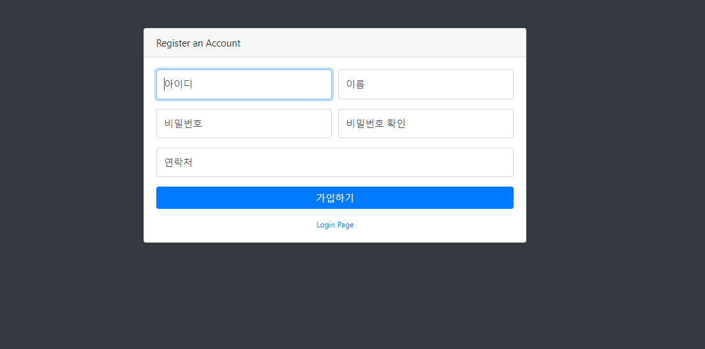
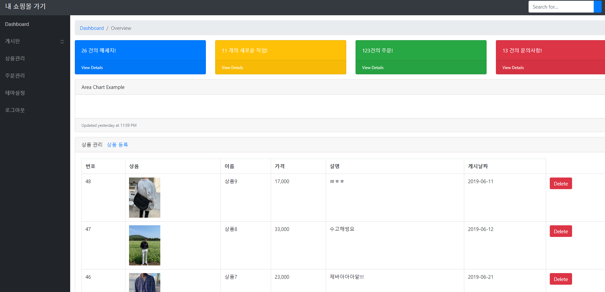

## WebPublishing-Service

### 간단한 클릭만으로도 웹사이트를 만들어 개인 쇼핑몰 창업을 도와주는 서비스

## 개발환경
1.서버: springboot  
2.DB: mariaDB 
3.배포: Docker 

## DB ERD설계 
<pre>
link: URL : http://aquerytool.com:80/aquerymain/index/?rurl=eff3c5ad-c895-47c2-a302-a178c9319472&  
Password : qzu74a
</pre>
## DB 생성(MariaDB)

## 구현 화면(개발 중입니다.)

### 1.가입 

### 2.관리자 화면

### 3.쇼핑몰 사용자 View 

